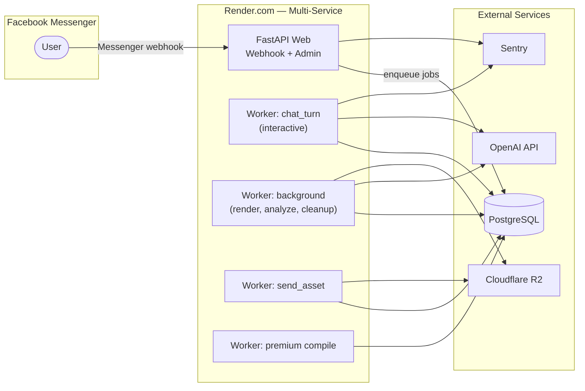

# Messenger Fortune-Telling Bot — Portfolio Edition

> **Bản trích lược portfolio / Curated portfolio subset**  
> Đây là bản trích lược có chọn lọc của một sản phẩm bot Messenger tử vi **production thực tế** (FastAPI + PostgreSQL + OpenAI + Docker + Render.com).  
> Một số module lõi (engine tính toán, thư viện prompt AI, logic monetization/premium funnel) đã được **rút gọn hoặc thay bằng stub** để bảo vệ IP sản phẩm — xem mục [What's omitted](#whats-omitted) bên dưới.

---

## Overview

A production-grade Facebook Messenger bot backend that handles webhook ingestion, async job processing, admin operations, media storage, and observability. This repository showcases **infrastructure and engineering patterns** — not the full proprietary product logic.

**This is a curated subset for portfolio purposes.** Core proprietary modules (fortune-telling calculation engine, AI prompt library, monetization logic) have been omitted or replaced with stubs.

---

## Architecture



**Request flow:** Messenger webhook → FastAPI (signature verification, dedupe) → PostgreSQL job queue → specialized workers → OpenAI / R2 / outbound Messenger API.

**Deployment:** 1 web service + 4 worker services + managed PostgreSQL, defined in `render.yaml` (Infrastructure as Code).

---

## Tech Stack

| Layer | Technologies |
|-------|-------------|
| API | FastAPI, Uvicorn, Pydantic |
| Database | PostgreSQL, psycopg3 connection pool |
| AI | OpenAI API |
| Storage | Cloudflare R2 (boto3, S3-compatible) |
| Observability | Sentry, structured logging with redaction |
| Admin | Streamlit portal |
| Media | Pillow, OpenCV (blur detection), python-magic |
| Testing | pytest, PostgreSQL integration harness |
| Deployment | Docker, Render.com Blueprint (`render.yaml`) |

---

## Engineering Highlights

Demonstrates production patterns across the full stack:

- **38 SQL migrations** (schema versions 001–042) — incremental schema evolution
- **pytest suite** with PostgreSQL integration harness and production-safety guards
- **Webhook signature verification** (Meta `X-Hub-Signature-256` HMAC)
- **Admin audit log** — immutable action trail for operator actions
- **GDPR / data-subject deletion** — `data_subject_service`, customer data reset flows
- **Worker retry with exponential backoff** — budget guardrails and job outcome tracking
- **Cost-cap enforcement pattern** — per-session/day limits for model calls, tokens, VND spend
- **Log redaction** — automatic scrubbing of tokens, DB URLs, signed URLs before output
- **Multi-worker topology** — latency-critical `chat_turn` isolated from long-running jobs

---

## What's omitted

The following proprietary modules are **not included** (stubbed or removed):

- Fortune-telling / astrology calculation engine (`tuvi_*`, chart builders)
- Production AI prompt library (`prompts/` — only a minimal example remains)
- Premium funnel, monetization, and cohort scoring logic
- Conversation intelligence (intent routing, birth extraction, user memory)
- Knowledge corpus and rulebooks (grounding data)

Infrastructure code references these modules via interfaces; reviewers can infer their roles from README and docstrings marked *"Core module omitted"*.

---

## Local Development

### Prerequisites

- Python 3.10+
- PostgreSQL (optional — for integration tests; unit tests run without DB)
- Docker (optional — for container build verification)

### Setup

```bash
# 1. Clone and enter the repo
cd menh-tri-am-bot-portfolio

# 2. Create virtual environment
python -m venv .venv
# Windows:
.venv\Scripts\activate
# macOS/Linux:
source .venv/bin/activate

# 3. Install dependencies
pip install -r requirements.txt

# 4. Configure environment
cp .env.example .env
# Edit .env with your local/test values (never commit .env)
```

### Run tests

```bash
# Unit tests (no PostgreSQL required)
pytest -m "not requires_postgres"

# Full suite including PostgreSQL integration tests
# See docs/test_infra.md for TEST_DATABASE_URL setup
pytest
```

### Docker build

```bash
docker build -t demo-bot-portfolio .
```

### Run API locally (requires DATABASE_URL and Facebook/OpenAI credentials)

```bash
uvicorn app.main:app --reload --port 8000
```

---

## Project Structure

```
app/
  api/           # FastAPI routes (messenger webhook, admin portal)
  middleware/    # Webhook signature verification
  workers/       # Async job queue, runner, retry/backoff
  services/      # Business services (admin, GDPR, media, etc.)
  media/         # Image validation, R2/disk storage
  utils/         # Logging redaction, Sentry, correlation IDs
sql/migrations/  # PostgreSQL schema migrations
tests/           # pytest suite + postgres harness
scripts/         # Deploy and ops scripts
render.yaml      # Render.com multi-service blueprint
docs/            # Runbooks and test infrastructure notes
```

---

## License

See [LICENSE](LICENSE). **All Rights Reserved — Portfolio Viewing Only.** No commercial use, redistribution, or reuse without written permission from the author.

---

*Portfolio repository — not affiliated with any live production deployment.*
